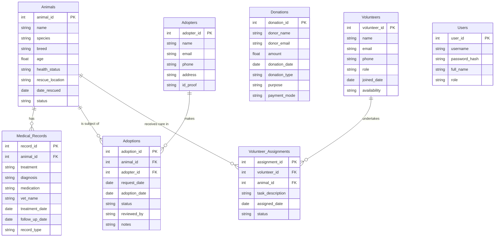
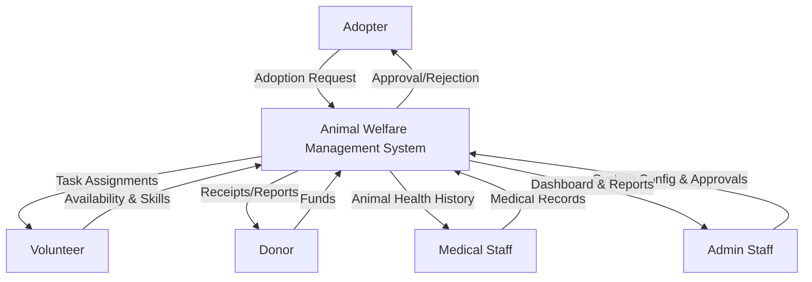
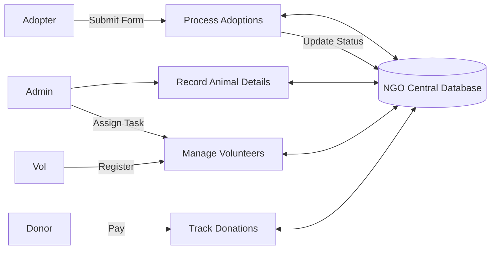

# Entity-Relationship (ER) Diagram

```mermaid
erDiagram
    Animals {
        int animal_id PK
        string name
        string species
        string breed
        float age
        string health_status
        string rescue_location
        date date_rescued
        string status
    }
    
    Adopters {
        int adopter_id PK
        string name
        string email
        string phone
        string address
        string id_proof
    }
    
    Adoptions {
        int adoption_id PK
        int animal_id FK
        int adopter_id FK
        date request_date
        date adoption_date
        string status
        string reviewed_by
        string notes
    }
    
    Donations {
        int donation_id PK
        string donor_name
        string donor_email
        float amount
        date donation_date
        string donation_type
        string purpose
        string payment_mode
    }
    
    Volunteers {
        int volunteer_id PK
        string name
        string email
        string phone
        string role
        date joined_date
        string availability
    }
    
    Volunteer_Assignments {
        int assignment_id PK
        int volunteer_id FK
        int animal_id FK
        string task_description
        date assigned_date
        string status
    }
    
    Medical_Records {
        int record_id PK
        int animal_id FK
        string treatment
        string diagnosis
        string medication
        string vet_name
        date treatment_date
        date follow_up_date
        string record_type
    }
    
    Users {
        int user_id PK
        string username
        string password_hash
        string full_name
        string role
    }

    Animals ||--o{ Medical_Records : "has"
    Animals ||--o{ Adoptions : "is subject of"
    Adopters ||--o{ Adoptions : "makes"
    Volunteers ||--o{ Volunteer_Assignments : "undertakes"
    Animals ||--o{ Volunteer_Assignments : "receives care in"
```

# Data Flow Diagram (DFD)

### Level 0 (Context Diagram)

```mermaid
graph TD
    A[Adopter] -->|Adoption Request| System[Animal Welfare Management System]
    System -->|Approval/Rejection| A
    V[Volunteer] -->|Availability & Skills| System
    System -->|Task Assignments| V
    D[Donor] -->|Funds| System
    System -->|Receipts/Reports| D
    M[Medical Staff] -->|Medical Records| System
    System -->|Animal Health History| M
    Admin[Admin Staff] -->|System Config & Approvals| System
    System -->|Dashboard & Reports| Admin
```

### Level 1 (Decomposed Process)

```mermaid
graph LR
    A1[Record Animal Details]
    A2[Process Adoptions]
    A3[Manage Volunteers]
    A4[Track Donations]
    
    DB[(NGO Central Database)]
    
    Admin --> A1
    A1 <--> DB
    
    Adopter -->|Submit Form| A2
    A2 <--> DB
    A2 -->|Update Status| DB
    
    Vol -->|Register| A3
    Admin -->|Assign Task| A3
    A3 <--> DB
    
    Donor -->|Pay| A4
    A4 <--> DB
```
